<div align="center">
  
</div>

<div align="center">
  
</div>

<div align="center">
  
</div>

<div align="center">
  
</div>

---

## 🚀 About Me

<div align="center">
  
  ```javascript
  const riyaz = {
    pronouns: "he" | "him",
    code: ["Apex", "JavaScript", "HTML", "CSS", "SOQL"],
    technologies: {
      salesforce: ["LWC", "Apex", "SOQL", "SOSL", "Flow Builder"],
      frontEnd: ["JavaScript", "HTML5", "CSS3", "Bootstrap"],
      tools: ["VS Code", "Git", "Salesforce CLI", "Workbench"],
      databases: ["Salesforce", "SQL"]
    },
    currentFocus: "Agentforce & Apex Phantom Development",
    funFact: "Life is good, you should get one! 🎯"
  };
  ```

</div>

- 🔭 **Currently working on:** Apex Phantom & Agentforce exploration
- 🌱 **Learning:** Advanced LWC patterns & modern UI/UX principles
- 👯 **Looking to collaborate on:** Salesforce Tech & LWC Projects
- 🤔 **Always curious about:** UI/UX patterns & modern JavaScript frameworks
- 💬 **Ask me about:** Lightning Web Components (LWC), Apex, Salesforce Architecture
- 📫 **Connect with me:** [LinkedIn](https://www.linkedin.com/in/shaik-riyaz-948350b1)
- ⚡ **Fun fact:** *"Stay hungry, stay foolish." – Steve Jobs*

---

## 🛠️ Tech Stack & Tools

<div align="center">

### 🏢 Salesforce Ecosystem
<div style="display: flex; justify-content: center; flex-wrap: wrap; gap: 10px;">
  
  
  
  
  
</div>

### 💻 Development
<div style="display: flex; justify-content: center; flex-wrap: wrap; gap: 10px;">
  
  
  
  
</div>

### 🛠️ Tools & Platforms
<div style="display: flex; justify-content: center; flex-wrap: wrap; gap: 10px;">
  
  
  
  
</div>

</div>

---

## 📊 GitHub Stats & Activity

<div align="center">
  
  
  
  
  
  
  
  

</div>

<div align="center">
  
</div>

---

## 🎯 Current Projects

<div align="center">

<div style="display: grid; grid-template-columns: repeat(auto-fit, minmax(300px, 1fr)); gap: 20px; margin: 20px 0;">

<div style="border: 2px solid #00A1E0; border-radius: 10px; padding: 20px; background: linear-gradient(135deg, #0e5ec2 0%, #00A1E0 100%); color: white; box-shadow: 0 4px 15px rgba(0,161,224,0.3);">
  <h3>🚀 Apex Phantom</h3>
  <p>Advanced Apex development framework</p>
  <span style="background: #FF6B35; padding: 5px 10px; border-radius: 15px; font-size: 12px;">🔥 In Progress</span>
</div>

<div style="border: 2px solid #10B981; border-radius: 10px; padding: 20px; background: linear-gradient(135deg, #059669 0%, #10B981 100%); color: white; box-shadow: 0 4px 15px rgba(16,185,129,0.3);">
  <h3>🤖 Agentforce</h3>
  <p>Exploring Salesforce Agentforce capabilities</p>
  <span style="background: #8B5CF6; padding: 5px 10px; border-radius: 15px; font-size: 12px;">🌱 Learning</span>
</div>

<div style="border: 2px solid #F59E0B; border-radius: 10px; padding: 20px; background: linear-gradient(135deg, #D97706 0%, #F59E0B 100%); color: white; box-shadow: 0 4px 15px rgba(245,158,11,0.3);">
  <h3>⚡ LWC Components</h3>
  <p>Reusable Lightning Web Components library</p>
  <span style="background: #00A1E0; padding: 5px 10px; border-radius: 15px; font-size: 12px;">📦 Active</span>
</div>

<div style="border: 2px solid #EC4899; border-radius: 10px; padding: 20px; background: linear-gradient(135deg, #DB2777 0%, #EC4899 100%); color: white; box-shadow: 0 4px 15px rgba(236,72,153,0.3);">
  <h3>🎨 UI/UX Patterns</h3>
  <p>Modern design patterns for Salesforce</p>
  <span style="background: #8B5CF6; padding: 5px 10px; border-radius: 15px; font-size: 12px;">💡 Researching</span>
</div>

</div>

</div>

---

## 🏆 Achievements & Skills

<div align="center">

### 🎖️ Salesforce Certifications


### 💪 Core Competencies
- **Apex Development** - Triggers, Classes, Controllers, Batch Jobs
- **Lightning Web Components** - Modern, reusable component architecture
- **Salesforce Integration** - REST/SOAP APIs, Platform Events
- **Data Management** - SOQL, SOSL, Data Import/Export
- **Process Automation** - Flow Builder, Process Builder, Workflow Rules
- **UI/UX Design** - Clean, intuitive user interfaces

</div>

---

## 📚 Learning Journey

```mermaid
graph LR
    A[Salesforce Admin] --> B[Platform Developer I]
    B --> C[LWC Specialist]
    C --> D[Agentforce Explorer]
    D --> E[Apex Phantom Developer]
    E --> F[UI/UX Expert]
    
    style A fill:#00A1E0
    style B fill:#14336F
    style C fill:#00A1E0
    style D fill:#FF6B35
    style E fill:#8B5CF6
    style F fill:#10B981
```

<div align="center">



</div>

---

## 🤝 Let's Connect!

<div align="center">

<div style="display: flex; justify-content: center; gap: 15px; flex-wrap: wrap; margin: 20px 0;">

<a href="https://www.linkedin.com/in/shaik-riyaz-948350b1" target="_blank">
  
</a>

<a href="https://github.com/RazzDino" target="_blank">
  
</a>

<a href="https://trailhead.salesforce.com/" target="_blank">
  
</a>

</div>

<div style="margin-top: 20px;">
  
</div>

</div>

---

## 💭 Favorite Quote

<div align="center">

<div style="background: linear-gradient(135deg, #667eea 0%, #764ba2 100%); border-radius: 15px; padding: 30px; margin: 20px 0; box-shadow: 0 8px 32px rgba(102,126,234,0.3); border: 1px solid rgba(255,255,255,0.2);">

<h2 style="color: white; margin: 0; font-size: 24px; text-shadow: 2px 2px 4px rgba(0,0,0,0.3);">
  
</h2>

</div>

</div>

---

## 🎉 Fun Facts

<div align="center">

<div style="display: grid; grid-template-columns: repeat(auto-fit, minmax(250px, 1fr)); gap: 15px; margin: 20px 0;">

<div style="background: linear-gradient(135deg, #FF6B6B 0%, #FF8E53 100%); border-radius: 10px; padding: 20px; color: white; box-shadow: 0 4px 15px rgba(255,107,107,0.3); animation: pulse 2s infinite;">
  <h3>🎯 Life Philosophy</h3>
  <p>Life is good, you should get one!</p>
</div>

<div style="background: linear-gradient(135deg, #4ECDC4 0%, #44A08D 100%); border-radius: 10px; padding: 20px; color: white; box-shadow: 0 4px 15px rgba(78,205,196,0.3); animation: pulse 2s infinite 0.5s;">
  <h3>☕ Fuel</h3>
  <p>Coffee and Salesforce documentation</p>
</div>

<div style="background: linear-gradient(135deg, #A8E6CF 0%, #7FCDCD 100%); border-radius: 10px; padding: 20px; color: white; box-shadow: 0 4px 15px rgba(168,230,207,0.3); animation: pulse 2s infinite 1s;">
  <h3>🎮 When not coding</h3>
  <p>Exploring new technologies and UI patterns</p>
</div>

<div style="background: linear-gradient(135deg, #FFD93D 0%, #FF6B6B 100%); border-radius: 10px; padding: 20px; color: white; box-shadow: 0 4px 15px rgba(255,217,61,0.3); animation: pulse 2s infinite 1.5s;">
  <h3>🌟 Goal</h3>
  <p>Building the future of CRM, one component at a time</p>
</div>

</div>

<style>
@keyframes pulse {
  0% { transform: scale(1); }
  50% { transform: scale(1.05); }
  100% { transform: scale(1); }
}
</style>

</div>

---

<div align="center">
  
</div>
